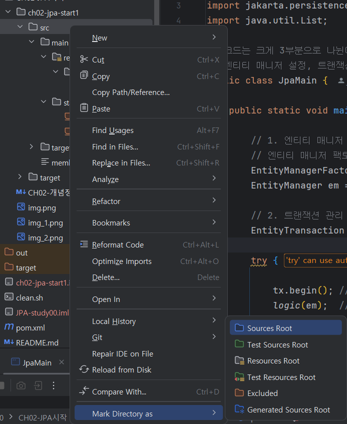

# 실습 준비

책에서 사용하는 기술 스택과 내가 선택한 스택은 다음과 같은 차이가 있다.


| 구분         | 책에서 사용한 스택 | 내가 사용한 스택 |
| ------------ | ------------------ | ---------------- |
| IDE          | Eclipse            | IntelliJ         |
| 빌드도구     | Maven              | Maven            |
| 데이터베이스 | H2                 | MySql            |

- JDK 17

Gradle에 익숙하지만 Maven을 한 번도 써본 적이 없어 사용해보고 싶었고, 책에서도 Maven 기준으로 설명하고 있어 이번 기회에 사용해보려 한다.
비밀번호 보안 상의 이유로 깃허브에 올리지 못한 `persistence.xml` 은 내 기술 스택에 맞춰 다음과 같이 수정되었다.

```xml
<?xml version="1.0" encoding="UTF-8"?>
<persistence xmlns="https://jakarta.ee/xml/ns/persistence" version="3.0">

   <persistence-unit name="jpabook">
      <properties>

         <!-- 필수 속성: MySQL 연결 정보 -->
         <property name="jakarta.persistence.jdbc.driver" value="com.mysql.cj.jdbc.Driver"/>
         <property name="jakarta.persistence.jdbc.url" value="jdbc:mysql://localhost:3306/{데이터베이스명}?serverTimezone=UTC&characterEncoding=UTF-8"/>
         <property name="jakarta.persistence.jdbc.user" value="{사용자명}"/>
         <property name="jakarta.persistence.jdbc.password" value="{비밀번호}"/>
         <property name="hibernate.dialect" value="org.hibernate.dialect.MySQLDialect" /> <!-- 데이터베이스 방언 설정 -->

         <!-- 옵션 -->
         <property name="hibernate.show_sql" value="true" />
         <property name="hibernate.format_sql" value="true" />
         <property name="hibernate.use_sql_comments" value="true" />
         <property name="hibernate.id.new_generator_mappings" value="true" />

         <!-- 테이블 자동 생성 옵션 -->
         <property name="hibernate.hbm2ddl.auto" value="update" />
      </properties>
   </persistence-unit>

</persistence>

```

<br>
<br>

# 2.4 객체 매핑 시작

[Member.java](https://github.com/jud1thDev/JPA-study/blob/673205f984b343863739ac62ba438374696f5a54/CH02-JPA%EC%8B%9C%EC%9E%91/ch02-jpa-start1/src/main/start/Member.java)에 주석을 추가하며 학습 내용을 정리하였다.

<br>
<br>

# 2.5 persistence.xml 설정

`persistence.xml` 파일이 META-INF 폴더 밑에 있으면 별도의 설정 없이 JPA가 해당 설정 파일을 인식할 수 있다.

<br>

## 2.5.1 데이터베이스 방언

JPA는 특정 데이터베이스에 종속되지 않지만, 각 데이터베이스마다 SQL 문법과 기능이 다르기 때문에 이를 해결하기 위해 **Hibernate Dialect**를 사용한다. `persistence.xml`의 코드에서 확인할 수 있다.

<br>
<br>

# 2.6 애플리케이션 개발

이제 애플리케이션 코드 [JpaMain.java](https://github.com/jud1thDev/JPA-study/blob/673205f984b343863739ac62ba438374696f5a54/CH02-JPA%EC%8B%9C%EC%9E%91/ch02-jpa-start1/src/main/start/JpaMain.java)를 살펴보자.

- 엔티티 매니저 설정
- 트랜잭션 관리
- 비즈니스 로직

이 3부분으로 구성되어 있다.



소스 폴더(src/main/java)가 프로젝트 모듈로 등록되지 않으면 애플리케이션 코드를 실행할 수 없으므로, 다음과 같이 설정해주었다.

<br>

## 2.6.1 엔티티 매니저 설정


1. 설정 정보 조회 - `persistence.xml`
   - `META-INF/persistence.xml` 파일에서 데이터베이스 연결 정보, JPA 설정 등을 조회함
2. `EntityManagerFactory` 생성
   - `Persistence` 클래스가 설정 정보를 읽고, `EntityManagerFactory` 객체를 생성함
   - `EntityManagerFactory`는 여러 `EntityManager`를 생성할 수 있는 공장 역할을 함
   - 애플리케이션 실행 시 **한 번만 생성하는 게 좋음** (비용이 크기 때문)
3. `EntityManager` 생성
   - `EntityManagerFactory`를 통해 여러 개의 `EntityManager`를 생성할 수 있음
   - `EntityManager`는 실제로 JPA를 사용해 엔티티를 관리하는 객체
   - 데이터베이스 연결(데이터베이스 커넥션)을 유지하면서 트랜잭션을 관리하고 SQL을 실행하는 역할을 하므로
   - 스레드 간에 공유하거나 재사용하면 안 됨
4. 종료
   - 엔티티 매니저, 엔티티 매니저 팩토리 종료

<br>

## 2.6.3 비즈니스 로직


`persist()`까지만 작성하고 mysql workbench에서 확인해보면 이런 식으로 JPA가 잘 작동하는 것을 확인할 수 있었다. (삭제까지 해버리면 결과를 확인할 수 없으니ㅎㅎ)

<br>

## 2.6.4 JPQL

목록 조회 또는 조건 검색 시에는 JPQL을 이용해야 한다. JPQL에 대한 자세한 내용은 10장에서 다룰 예정이다.


| 기능      | `em.find()`             | `em.createQuery()`                               |
| --------- | ----------------------- | ------------------------------------------------ |
| 조회 방식 | 기본 키(PK)로 단건 조회 | JPQL로 목록 조회                                 |
| 조회 대상 | 개별 엔티티             | 엔티티 목록 (cf. SQL은 데이터베이스 테이블 대상) |
