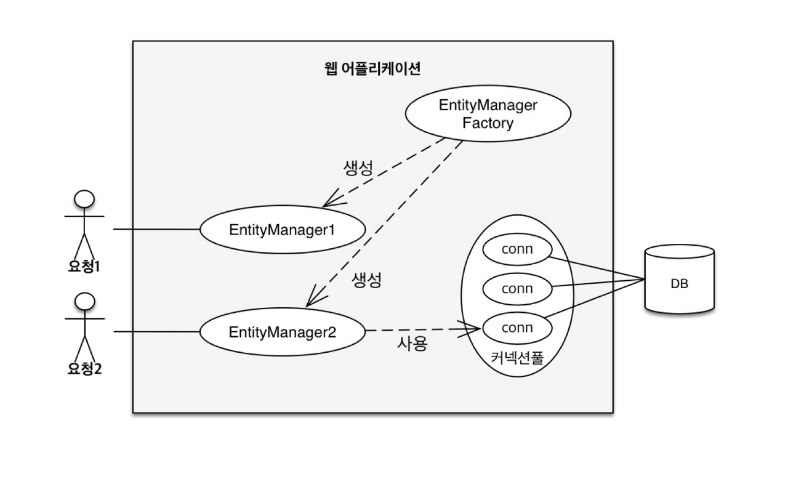

JPA가 제공하는 기능은 크게

1. 설계: 엔티티와 테이블을 매핑
2. 설계한 것을 사용: 엔티티 매니저가 하는 일

으로 나눌 수 있다.

# 3.1 엔티티 매니저 팩토리와 엔티티 매니저

2장의 [JpaMain.java](https://github.com/jud1thDev/JPA-study/blob/2b5dae354e86284510e2007f9d40c46aa5f1c721/CH02-JPA%EC%8B%9C%EC%9E%91/ch02-jpa-start1/src/main/start/JpaMain.java)에서 엔티티 매니저 팩토리를 생성하는 코드는 다음과 같았다.

```JAVA
EntityManagerFactory emf = Persistence.createEntityManagerFactory("jpabook");  
EntityManager em = emf.createEntityManager();
```

- 엔티티 매니저 팩토리 생성
  - 첫 줄의 코드는, `persistence.xml`에 정의된 `persistence-unit` 이름이 "jpabook"인 설정을 기반으로 `EntityManagerFactory`를 생성하는 코드이다.
  - 공장을 만드는 비용은 크다.
  - 애플리케이션 전체에서 딱 한 번 생성해서 공유하는 게 일반적이다.
  - 엔티티 매니저 팩토리는 여러 스레드가 동시에 접근해도 안전함 → 여러 스레드 간에 공유해도 됨.
- 엔티티 매니저 생성
  - 두 번째 줄의 코드는, 위에서 만든 팩토리로부터 `EntityManager`를 하나 생성하는 코드이다.
  - 엔티티 매니저를 생성하는 비용은 거의 들지 않는다.
  - 동시성 문제때문에, 여러 스레드 간에 절대 공유하면 안 된다.
  - 데이터에 접근해 엔티티를 CRUD하는 일을 담당하며, 하나의 트랜잭션 단위나 요청 단위로 사용한다. → 트랜잭션이 시작할 때 DB와 커넥션을 획득하고, 트랜잭션이 끝나면 닫는다.



이미지를 살펴보면, 엔티티 매니저 팩토리가 두 개의 엔티티 매니저를 만들었다. 그리고 엔티티 매니저 2만 데이터베이스와 커넥션이 있는 상태이다.

- JPA 구현체(ex. Hibernate)들은 J2SE 환경에서 EntityManagerFactory를 생성할 때, 내부적으로 설정을 기반으로 커넥션 풀까지 직접 생성한다. (11장에서 계속)
- 반면, **스프링 환경에서는 애플리케이션 서버나 프레임워크가 관리하는 DataSource(커넥션 풀)를 주입**받아 사용하므로, **JPA 구현체가 직접 커넥션 풀을 생성하지 않고** 이를 활용하는 방식이다.

<br>

- J2SE는 아래와 같은 자바 플랫폼들 중 하나이다.
  - J2SE (Java SE): 일반적인 자바 프로그램을 위한 표준 환경. 우리가 흔히 사용하는 `main` 메서드로 시작하는 일반 자바 프로그램이 이 환경에서 실행됨.
  - J2EE (Java EE → 지금은 Jakarta EE): 웹 서버나 기업용 서버 애플리케이션을 위한 환경 (ex. 서블릿, JSP, EJB)
    - 스프링은 J2EE 기술을 사용하는 프레임워크임.
  - J2ME (Java ME): 임베디드 기기나 모바일 기기를 위한 경량 자바 플랫폼 (지금은 거의 안 씀)

<br>
<br>

# 3.2 영속성 컨텍스트란

- 영속성 컨텍스트(persistence context):
  - JPA 전용 메모리 공간, 그 안에 들어간 엔티티는 JPA가 알아서 업데이트해줌.
  - `em.persist(member)` 를 통해 엔티티를 저장한다는 것 = 자세히 말하자면, 엔티티 메니저가 영속성 컨텍스트에 엔티티를 보관하고 관리한다는 것

<br>
<br>

# 3.3 엔티티의 생명주기

- 비영속(new) 상태: 아직 영속성 컨텍스트에 없음
  - `Member member = new Member();`
- 영속(managed) 상태: 영속성 컨텍스트에 관리되는 상태
  - `em.persist()`
  - `em.find()`
  - JPQL 조회: 단, DTO로 조회한 경우는 해당 안 됨. DTO는 엔티티가 아니므로..
- 준영속(detached) 상태: 관리하다가 뺀 상태 (`em.detach(entity)` 등)
- 삭제(removed) 상태: 삭제 예약된 상태 (`em.remove(entity)`)

<br>
<br>

# 3.4 영속성 컨텍스트

- 영속 상태는 반드시 **식별자 값**이 있어야 한다: 식별자 값으로 엔티티를 구분하기 때문이다.
- **flush**: 영속성 컨텍스트에 있는 변경 내용을 DB에 반영하는 동작
- 영속성 컨텍스트의 장점
  - 1차 캐시:
    - 동일한 엔티티를 여러 번 조회해도 DB에 접근하지 않고 **캐시에서 반환**함.
    - 성능 good, **엔티티의 동일성 보장**
  - 쓰기 지연:
    - 트랜잭션 커밋 시점에 한꺼번에 쿼리를 모아서 실행함.
    - 성능 good, **일관성 보장**
  - 변경 감지
  - 지연 로딩

<br>

## 3.4.1 엔티티 조회

- 1차 캐시: 영속성 컨텍스트 내부의 캐시

[JpaMain.java](https://github.com/jud1thDev/JPA-study/blob/2b5dae354e86284510e2007f9d40c46aa5f1c721/CH02-JPA%EC%8B%9C%EC%9E%91/ch02-jpa-start1/src/main/start/JpaMain.java)

```java
Member member = new Member(); // 엔티티 단순 생성(비영속)
em.persist(member); // 엔티티 영속 - 1차 캐시에 저장
Member findMember = em.find(Member.class, id); // 메서드 호출 시 1차 캐시에서 식별자 값으로 엔티티를 찾는다. 1차 캐시에 없다면, 데이터베이스를 조회해서 엔티티를 생성한 후 1차 캐시에 저장한다.
```

- 동일한 엔티티를 여러 번 조회해도 DB에 접근하지 않고 **캐시에서 반환**하므로, **성능상 이점과 엔티티의 동일성**을 보장한다.
- 엔티티의 동일성 보장: `a == b`가 성립됨 (`equals()` 말고 진짜 객체 동일성)

<br>

## 3.4.2 엔티티 등록

- flush: 엔티티 매니저는 **커밋하는 순간** 데이터베이스에 SQL을 날린다.
- 쓰기 지연: 트랜잭션 커밋 전까지는 데이터베이스 대신 내부 쿼리 저장소에 SQL들을 모아둔다.
- 성능에 유리하고, 일관성도 보장 가능하다.

<br>

## 3.4.3 엔티티 수정

지난 장에서 JPA에는 update()와 같은 별도의 수정 메서드는 없다고 배웠다. 그냥 `member.setAge(20);`처럼 set만 해주면 되는데, 그 이유는 **JPA의 변경 감지 기능** 덕분이다.

- JPA의 변경 감지 기능: JPA는 엔티티의 변경사항을 추적하는 기능이 있으므로, 값이 변경되면 UPDATE SQL이 실행된다.
- 더 자세히는, **flush 시점에 스냅샷과 엔티티를 비교**해서 변경된 엔티티를 찾는 것이다.
- **변경 감지는** 영속성 컨텍스트가 관리하는 **영속 상태의 엔티티에만 적용**된다.
  - 비영속, 준영속의 경우는 엔티티 값을 변경해도 데이터베이스에 반영되지 않는다.
- JPA의 기본 전략은 엔티티의 모든 필드를 업데이트허는 것이다.
  - 필드마다 변경 여부를 일일이 추적하지 않아도 되므로 편리하고,
  - 수정 쿼리가 항상 같으며,
  - 엔티티가 복잡하지 않으면 성능 차이가 크기 않기 때문이다.
- 컬럼이 30개 이상 된다면 `@DynamicUpdate`(Hibernate 전용)를 활용한 동적 수정 쿼리가 빠르다고 한다. (그런 상황이 된다면, 테스트로 두 상황을 비교해 보아라.)

<br>

## 3.4.4 엔티티 삭제

JPA는 삭제 대상이 **영속 상태**여야 `em.remove()`를 사용할 수 있기 때문에, 먼저 조회(`em.find()`)해서 영속 상태로 만들어야 한다.

<br>

# 3.5 플러시

- flush하면 발생하는 일
  1. 변경 감지 기능 동작
  2. 영속성 컨텍스트의 모든 엔티티를 스냅샷과 비교
  3. 엔티티 수정을 위한 SQL문을 만들어 쓰기 지연 저장소에 저장
  4. SQL문을 데이터베이스에 전송

<br>

- flush하는 방법 3가지
  1. em.flush() 메서드 직접 호출: 보통 테스트 or 다른 프레임워크와 JPA를 함께 사용할 때만 사용함.
  2. 트랜잭션 커밋을 통한 자동 호출
  3. JPQL 쿼리 실행을 통한 자동 호출: DB에서 최신 상태의 데이터를 조회해야 하므로, 그 전에 변경 내용을 DB에 반영해주기 위함.

<br>

- FlushMode: JPA가 언제 flush를 자동으로 수행할지를 결정하는 설정값
  - `FlushModeType.AUTO` (기본값): 다음 두 상황에 자동으로 flush 수행됨
    1. 트랜잭션 커밋 전
    2. JPQL 쿼리 실행 전
  - `FlushModeType.COMMIT`: **트랜잭션 커밋 시에만** flush 수행됨.
    - JPQL 실행 전에 flush를 하지 않으므로, 조회 성능은 좋아질 수 있으나 최신 상태 보장 X

<br>
<br>

# 3.6 준영속

- 준영속(detached) 상태: 관리하다가 뺀 상태
- 영속 상태가 아니므로 영속성 컨텍스트가 제공하는 기능들을 사용할 수 없다.
- 개발자가 `detach()`를 직접 호출해서 엔티티를 준영속 상태로 만드는 경우는 드물고,
  대부분은 트랜잭션이 끝나거나 EntityManager가 종료되면서 영속성 컨텍스트가 사라지고, 그 안에 있던 모든 엔티티가 준영속 상태가 된다.

<br>

- `em.detach(entity)`: 특정 엔티티 하나만 영속성 컨텍스트에서 분리
  - 필요 시 다시 `merge()`로 영속 상태로 복귀 가능
- `em.clear()`: 영속성 컨텍스트에 있는 **모든 엔티티**를 detach
  - 실무에서 JPQL 벌크 연산 이후 정합성 유지를 위해 자주 사용됨
  - 필요 시 다시 `merge()`로 영속 상태로 복귀 가능
- `em.close()`: 영속성 컨텍스트 자체를 종료
  - EntityManager 자체가 닫히므로 `merge()`를 포함한 엔티티 매니저 기능을 더 이상 사용 불가
