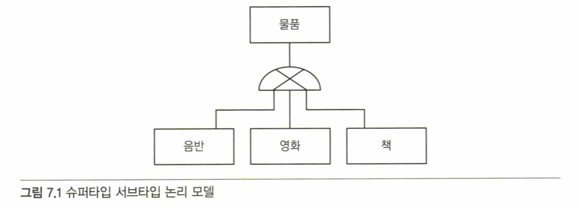

# 7.1 상속 관계 매핑

- 상속 관계 매핑: 객체지향의 상속을 DB에 매핑하는 방법
- 관계형 DB엔 상속이 없어서 "슈퍼타입/서브타입 관계"로 구현함



- JPA에서는 상속 관계 매핑을 위해 3가지 전략을 제공


  | 전략 구분                            | 설명                                            | 장점                  | 단점                                     |
  | ------------------------------------ | ----------------------------------------------- | --------------------- | ---------------------------------------- |
  | 조인 전략 (`JOINED`)                 | 부모, 자식 각각 테이블을 가져 조회 시 조인 필요 | 정규화, 저장공간 효율 | 쿼리 복잡하고 조회 느림, INSERT 2번 발생 |
  | 단일 테이블 전략 (`SINGLE_TABLE`)    | 하나의 테이블에 다 저장                         | 성능 좋음, 단순 쿼리  | NULL 허용이 많고 테이블 비대해짐         |
  | 구현 클래스 전략 (`TABLE_PER_CLASS`) | 자식마다 별도 테이블                            | 서브타입 구분 쉬움    | 비추천, union필요                        |

<br>

## 7.1.1 조인 전략

- 상속 구조의 각 엔티티(부모, 자식)를 각각 테이블로 매핑함
- 자식 테이블은 부모 테이블의 기본 키를 받아 외래 키이자 기본 키로 사용함
- 조인해서 데이터를 조회해야 하므로 조회 성능은 느릴 수 있음
- 타입 구분을 위해 DTYPE 같은 구분 컬럼 필요함

```JAVA
@Entity
@Inheritance(strategy = InheritanceType.JOINED) // 조인 전략 지정
@DiscriminatorColumn(name = "DTYPE") // 구분 컬럼 설정
public abstract class Item {
@Id
@GeneratedValue
private Long id;

    private String name;
}

@Entity
@DiscriminatorValue("B") // 구분 컬럼에 저장할 값 지정 (선택)
@PrimaryKeyJoinColumn(name = "book_id") // 자식 테이블의 PK 이름 변경
public class Book extends Item {
private String author;
private String isbn;
}
```

- `@Inheritance(strategy = InheritanceType.JOINED)`
  - 상속 매핑 시 사용하는 어노테이션으로, **부모 클래스에 필수로 지정해야 함**
  - InheritanceType.JOINED는 조인 전략을 의미함
- `@DiscriminatorColumn(name = "DTYPE")`
  - 상속된 자식 엔티티를 구분하기 위한 컬럼 지정
  - **생략 가능하지만 명시하는 것이 좋음** (기본값은 DTYPE)
- `@DiscriminatorValue("B")`
  - 구분 컬럼에 저장할 값을 지정
  - 생략하면 클래스 이름(Book)이 기본값으로 들어감
- `@PrimaryKeyJoinColumn(name = "book_id")`
  - 자식 테이블의 PK 컬럼명을 명시적으로 지정
  - 기본적으로 부모 테이블의 PK 컬럼명이 그대로 쓰이지만 변경 가능

<br>

## 7.1.2 단일 테이블 전략

- 부모와 자식 엔티티를 모두 하나의 테이블에 저장함
- 구분 컬럼(DTYPE)으로 어떤 자식인지 구별함
- 조인을 사용하지 않으므로 조회 성능이 가장 빠름
- 대신 모든 자식의 필드를 다 포함해야 하므로 테이블이 커지고 null이 많이 발생함

```JAVA
@Entity
@Inheritance(strategy = InheritanceType.SINGLE_TABLE) // 단일 테이블 전략 지정
@DiscriminatorColumn(name = "DTYPE") // 구분 컬럼 설정
public abstract class Item {
@Id
@GeneratedValue
private Long id;

    private String name;
}

@Entity
@DiscriminatorValue("B") // 구분 컬럼 값 지정
public class Book extends Item {
private String author;
private String isbn;
}

@Entity
@DiscriminatorValue("A")
public class Album extends Item {
private String artist;
}
```

<br>

## 7.1.3 구현 클래스 전략

- 부모 엔티티는 추상 클래스처럼 테이블로 매핑하지 않고, 자식 엔티티마다 각각 별도의 테이블을 생성함.
- 자식 테이블에는 부모 클래스의 필드도 모두 포함되어야 함
- 조인이 없지만, 여러 자식을 함께 조회할 땐 UNION 사용이 필요함

```JAVA
@Entity
@Inheritance(strategy = InheritanceType.TABLE_PER_CLASS) // 구현 클래스마다 테이블 전략
public abstract class Item {
@Id
@GeneratedValue
private Long id;

    private String name;
}

@Entity
public class Book extends Item {
private String author;
private String isbn;
}

@Entity
public class Album extends Item {
private String artist;
}
```

- 테이블이 분리되어 있어 타입 구분 컬럼(`@DiscriminatorColumn`, `@DiscriminatorValue`)이 필요하지 않음

# 7.2 @MappedSuperclass

- 등록일, 수정일 같이 여러 엔티티에서 공통으로 사용하는 매핑 정보만 상속받고 싶을 때 사용

# 7.3 복합 키와 식별 관계 매핑

- 데이터베이스의 식별자가 하나 이상일 때 매핑하는 방법을 다룸

# 7.4 조인 테이블

- 연관관계를 관리하는 연결 테이블을 매핑하는 방법을 다룸

# 7.5 엔티티 하나에 여러 테이블 매핑

# 7.6 정리
