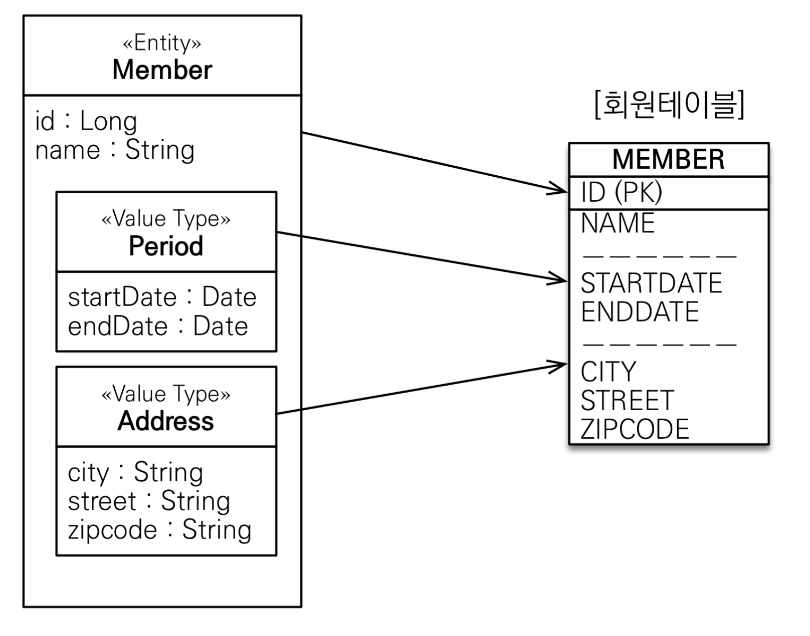
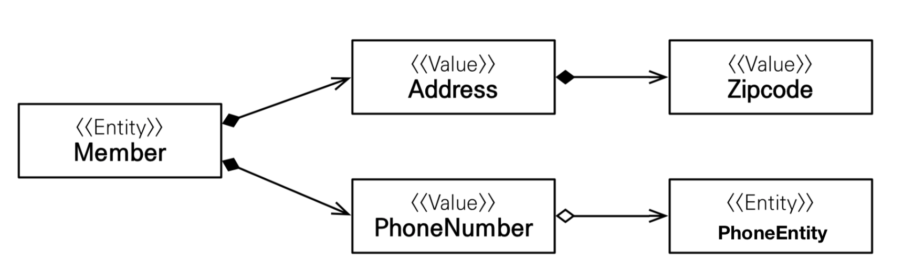
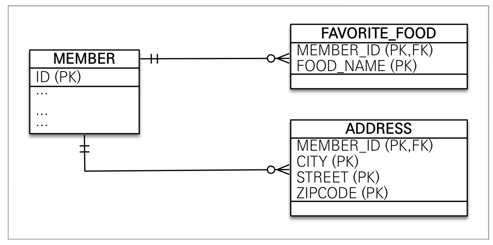

JPA에서는 데이터를 크게 두 가지 타입으로 분류할 수 있다.

- 엔티티 타입: `@Entity`로 정의된 객체, 식별자(@Id)를 통해 지속적으로 추적 가능
- 값 타입: 단순히 값으로 사용하는 자바 기본 타입 또는 객체 (int, Integer, String 등)
  - 기본값 타입: 자바가 제공
  - 임베디드 타입: JPA에서 사용자가 직접 정의
  - 컬렉션 값 타입: 하나 이상의 값 타입을 저장할 때 사용

<br>
<br>

# 9.1 기본값 타입

기본값 타입은 다음 3가지로 나눌 수 있다.

- 자바의 기본 타입: int, double 등
- 임베디드 타입: Integer, Double 등
- String 같은 타입

```JAVA
@Entity
public class Member {
    @Id @GeneratedValue
    private Long id;
    private String name;
    private int age;
}
```

Member 엔티티의 name, age는 값 타입에 해당한다.

- 값 타입의 특성
  - 엔티티 타입과 달리 식별자(@Id)가 없음
  - 엔티티의 생명주기에 의존. 즉, 엔티티가 제거되면 같이 제거됨
  - 공유되지 않고, 복사해서 사용해야 함 (cf. Integer, String은 불변객체로 설계되어 있어서 값 타입이면서도 공유될 수 있는 특수한 경우)

<br>
<br>

# 9.2 임베디드 타입(복합 값 타입)

- 사용자가 직접 정의할 수 있는 값 타입 
- 객체 지향적인 설계를 가능하게 하며, 코드의 응집도를 높임

```JAVA
@Entity
public class Member {
    @Id @GeneratedValue
    private Long id;
    private String name;

    @Embedded //  값 타입을 사용하는 엔티티 필드에 사용
    private Period workPeriod;

    @Embedded
    private Address homeAddress;
}

@Embeddable // 값 타입 정의 위치에 사용
public class Period {
    @Temporal(TemporalType.DATE)
    private Date startDate;
    @Temporal(TemporalType.DATE)
    private Date endDate;
    
    public boolean isWork(Date date){
        // 값 타입을 위한 메서드 정의 가능
    }
}

@Embeddable
public class Address {
    
    @Column(name = "city") // 매핑할 컬럼 정읙 가능
    private String city;
    private String street;
    private String zipcode;
}

// 기본 생성자 필수
```


- `@Embeddable` : 값 타입을 정의하는 클래스에 사용
- `@Embedded` : 엔티티에서 값 타입을 사용하는 필드에 사용
- 임베디드 타입은 기본 생성자 필수
- 엔티티의 생명주기에 의존하며, 컴포지션 관계로 표현됨

회원이 상세한 데이터를 그대로 가지고 있는 것은 객체지향적이지 않으므로, [근무기간, 집 주소]를 가지도록 임베디드 타입을 사용했다.

<br>

## 9.2.1 임베디드 타입과 테이블 매핑

- 임베디드 타입은 엔티티의 값으로 매핑되며, 엔티티와 동일한 테이블에 저장 
- 임베디드 타입 내부 필드가 테이블의 컬럼으로 매핑됨 (다시 한 번, 매핑해주는 JPA에게 땡큐..)

<br>

## 9.2.2 임베디드 타입과 연관관계

- 임베디드 타입은 다른 값 타입이나 엔티티를 포함할 수 있음

```JAVA
@Entity
public class Member {
	
    @Embedded Address address; 		   // 임베디드 타입 포함
    @Embedded PhoneNumber phoneNumber; // 임베디드 타입 포함
}
    
@Embeddable
public class Address {

	String street;
    String city;
	@Embeddable Zipcode zipcode; // 임베디드 타입 포함
  	...
}

@Embeddable
public class Zipcode {

	String zip;
  	...
}

@Embeddable
public class PhoneNumber {

	@ManyToOne PhoneServiceProvider provider // 엔티티 참조
  	...
}

@Entity
public class PhoneServiceProvider {
	
    @Id String name;
    ...
}
```



<br>

## 9.2.3 @AttributeOverride: 속성 재정의

- `@AttributeOverride` 사용해서 임베디드 타입의 매핑 속성을 재정의할 수 있음
  - 너무 많이 사용하면 엔티티 코드가 지저분해질 수 있으나, 사실 그러는 경우는 매우 드물다.

```JAVA
@Entity
public class Member {
    @Id @GeneratedValue
    private Long id;
    private String name;

    @Embedded Address homeAddress;

    @Embedded 
    @AttributeOverrides({
        @AttributeOverride(name="city", column=@Column(name="company_city")),
        @AttributeOverride(name="street", column=@Column(name="company_street")),
        @AttributeOverride(name="zipcode", column=@Column(name="company_zipcode"))
    })
    private Address companyAddress;
}
```

<br>

## 9.2.4 임베디드 타입과 null

- 임베디드 타입이 null이면 매핑한 컬럼 값은 모두 null임


<br>
<br>

# 9.3 값 타입과 불변객체

## 9.3.1 값 타입 공유 참조의 위험성

- 값 타입을 여러 엔티티에서 공유하면 위험 (side effect 발생)
- 예상치 못한 곳에서 값이 변경될 수 있음

```JAVA
member1.setHomeAddress(new Address("OldCity"));
Address address = member1.getHomeAddress();

address.setCity("NewCity"); // 회원1의 address 값을 공유해서 사용 -> 회원1의 주소도 변경
member2.setHomeAddress(address);
```

<br>

## 9.3.2 값 타입 복사

- 위와 같은 부작용을 막기 위해, **값을 복사해서 사용**해야 함

```JAVA
member1.setHomeAddress(new Address("OldCity"));
Address address = member1.getHomeAddress();

// 회원1의 address 값을 복사
Address newAddress = address.clone();

newAddress.setCity("NewCity");
member2.setHomeAddress(newAddress);
```

<br>

## 9.3.3 불변 객체 (Immutable Object)

그러나 임베디드 타입과 같은 자바의 객체 타입에서 문제가 발생한다. 기본 타입(int, double 등)은 값을 직접 저장하고, 전달할 때 값을 복사한다. 객체 타입(Address, String 등)은 참조(메모리 주소)를 전달한다. → 즉, **복사된 건 객체가 아니라 객체의 주소**.
- 해결: 값 타입을 **불변 객체**로 만들어 변경 불가하게 설계 
- 생성자 외에 값을 변경할 수 있는 메서드를 제공하지 않음 (Setter 미제공)

```JAVA
@Embeddable
public class Address {
    private final String city;

    protected Address() {} // JPA 기본 생성자 필수

    public Address(String city) {
        this.city = city;
    }

    public String getCity() {
        return city;
    }
}
```

<br>
<br>

# 9.4 값 타입의 비교

- `equals()`, `hashCode()`를 반드시 재정의해야 안전 
  - 동일성 비교: 인스턴스의 참조 값을 비교, `==` 사용 
  - 동등성 비교: 인스턴스의 값을 비교, `equals()` 사용
- 컬렉션에서 값 타입을 비교할 때 필요

<br>
<br>

# 9.5 값 타입 컬렉션

- 여러 값을 저장하기 위한 값 타입 컬렉션 사용 
- `@ElementCollection`(값 타입 컬렉션), `@CollectionTable`(컬렉션 테이블 매핑) 사용

```JAVA
@Entity
public class Member {
    @Id @GeneratedValue
    private Long id;
    private String name;

    @Embedded Address homeAddress;

    @ElementCollection
    @CollectionTable(name = "FAVORITE_FOODS", joinColumns = @JoinColumn(name = "MEMBER_ID"))
    @Column(name = "FOOD_NAME")
    private Set<String> favoriteFoods = new HashSet<String>();

    @ElementCollection
    @CollectionTable(name = "ADDRESS", joinColumns = @JoinColumn(name = "MEMBER_ID"))
    private List<Address> addressHistory = new ArrayList<Address>();

}
```

- 관계형 데이터베이스의 테이블은 컬럼 안에 컬렉션을 포함할 수 없기 때문에 별도의 테이블을 추가해야 함

<br>

## 9.5.1 값 타입 컬렉션 사용

- 기본값 타입 (String), 임베디드 값 타입 (Address) 저장 가능 
- 컬렉션의 데이터는 별도의 테이블에 저장되며, LAZY 로딩이 기본

## 9.5.2 값 타입 컬렉션의 제약사항

- 변경 시 전체 삭제 후 재삽입 (성능 문제 발생 가능)
- 값 타입 컬렉션의 테이블은 모든 컬럼을 기본 키로 설정해야 함 
- 대용량 데이터 저장 시 새로운 엔티티로 일대다 관계 전환 권장