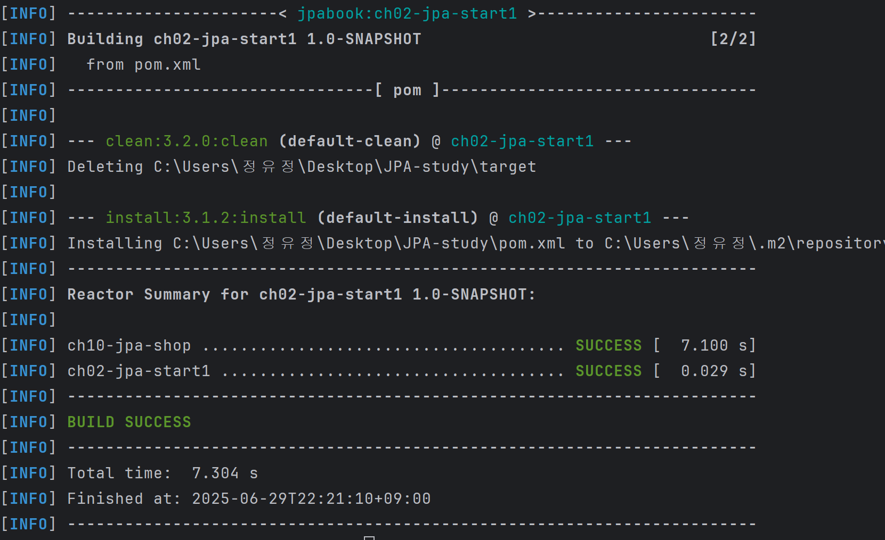

드디어 직접 프로젝트 실습 ~.~ CH10 하면서 빌드 시도하는 과정에서 버전차이 다 맞춰놨으므로 ch10-jpa-shop으로 진행하겠습니다.

# 11.1 프로젝트 환경설정

- 프로젝트 터미널에서 `mvn clean install`
- 테스트 없이 빌드: `mvn clean install -DskipTests`

빌드에 성공하면 target 폴더 내부에 jar파일이 생긴 것을 확인할 수 있다.