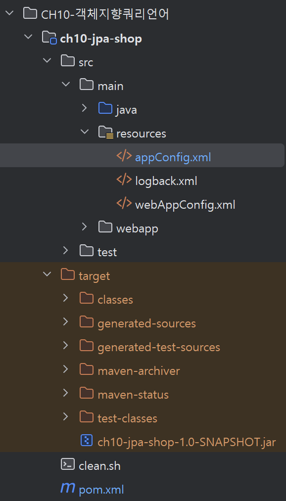

드디어 직접 프로젝트 실습 ~.~ CH10 하면서 빌드 시도하는 과정에서 버전차이 다 맞춰놨으므로 ch10-jpa-shop으로 진행하겠습니다.

# 11.1 프로젝트 환경설정

- 프로젝트 터미널에서 `mvn clean install`
- 테스트 없이 빌드: `mvn clean install -DskipTests`




빌드에 성공하면 target 폴더 내부에 jar파일이 생긴 것을 확인할 수 있다.

<br> <br>

## 11.1.3 스프링 프레임워크 설정 

- /webapp/WEB-INF/web.xml : 웹 애플리케이션 환경설정
- /resources/webAppConfig.xml : 웹 계층(Spring MVC)과 JPA 연동을 위한 설정
- /resources/appConfig.xml : 스프링 애플리케이션 관련 설정

### [web.xml](https://github.com/jud1thDev/JPA-study/blob/675fa489435235db4fd15a9dd2a0458ba8a87361/CH10-%EA%B0%9D%EC%B2%B4%EC%A7%80%ED%96%A5%EC%BF%BC%EB%A6%AC%EC%96%B8%EC%96%B4/ch10-jpa-shop/src/main/webapp/WEB-INF/web.xml)

```XML
<?xml version="1.0" encoding="UTF-8" standalone="no"?>
<web-app xmlns="http://java.sun.com/xml/ns/javaee"
xmlns:xsi="http://www.w3.org/2001/XMLSchema-instance"
xsi:schemaLocation="http://java.sun.com/xml/ns/javaee http://java.sun.com/xml/ns/javaee/web-app_3_0.xsd"
version="3.0" metadata-complete="true">

    <filter>
        <filter-name>encodingFilter</filter-name>
        <filter-class>org.springframework.web.filter.CharacterEncodingFilter</filter-class>
        <init-param>
            <param-name>encoding</param-name>
            <param-value>UTF-8</param-value>
        </init-param>
    </filter>
    <filter-mapping>
        <filter-name>encodingFilter</filter-name>
        <url-pattern>/*</url-pattern>
    </filter-mapping>

    <listener>
        <listener-class>org.springframework.web.context.ContextLoaderListener</listener-class>
    </listener>

    <!-- appConfig 설정 부분: 비즈니스 도메인 계층 관리 -->
    <context-param>
        <param-name>contextConfigLocation</param-name>
        <param-value>classpath:appConfig.xml</param-value>
    </context-param>

    <servlet>
        <servlet-name>dispatcher</servlet-name>
        <servlet-class>org.springframework.web.servlet.DispatcherServlet</servlet-class>
        <init-param>
            <!-- webAppConfig 설정 부분: 스프링 MVC 설정 등 웹 계층 관리 -->
            <param-name>contextConfigLocation</param-name>
            <param-value>classpath:webAppConfig.xml, classpath:appConfig.xml</param-value>
        </init-param>
        <load-on-startup>1</load-on-startup>
    </servlet>

    <servlet-mapping>
        <servlet-name>dispatcher</servlet-name>
        <url-pattern>/</url-pattern>
    </servlet-mapping>

</web-app>
```

<br>

### [webAppConfig.xml](https://github.com/jud1thDev/JPA-study/blob/675fa489435235db4fd15a9dd2a0458ba8a87361/CH10-%EA%B0%9D%EC%B2%B4%EC%A7%80%ED%96%A5%EC%BF%BC%EB%A6%AC%EC%96%B8%EC%96%B4/ch10-jpa-shop/src/main/resources/webAppConfig.xml)

```XMl
<?xml version="1.0" encoding="UTF-8"?>
<beans xmlns="http://www.springframework.org/schema/beans"
       xmlns:xsi="http://www.w3.org/2001/XMLSchema-instance" xmlns:mvc="http://www.springframework.org/schema/mvc"
       xmlns:context="http://www.springframework.org/schema/context"
       xsi:schemaLocation="http://www.springframework.org/schema/beans http://www.springframework.org/schema/beans/spring-beans.xsd http://www.springframework.org/schema/mvc http://www.springframework.org/schema/mvc/spring-mvc.xsd http://www.springframework.org/schema/context http://www.springframework.org/schema/context/spring-context.xsd">

    <!-- 어노테이션 기반 스프링 MVC 기능 활성화. 내부적으로 RequestMappingHandlerMapping, RequestMappingHandlerAdapter 등을 등록해줌 -->
    <mvc:annotation-driven/>

    <!-- @Controller를 비롯한 @Component, @Service, @Repository 등 애노테이션이 붙은 클래스를 자동으로 빈으로 등록함 -->
    <context:component-scan base-package="jpabook.jpashop.web"/>

    <!-- 컨트롤러가 반환한 뷰 이름(ex. "home")을 실제 JSP 경로(/WEB-INF/jsp/home.jsp)로 매핑해주는 역할 -->
    <bean id="viewResolver" class="org.springframework.web.servlet.view.InternalResourceViewResolver">
        <property name="viewClass" value="org.springframework.web.servlet.view.JstlView"/>
        <property name="prefix" value="/WEB-INF/jsp/"/>
        <property name="suffix" value=".jsp"/>
    </bean>

    <mvc:default-servlet-handler/>

    <mvc:interceptors>
        <bean class="org.springframework.orm.jpa.support.OpenEntityManagerInViewInterceptor">
            <property name="entityManagerFactory" ref="entityManagerFactory" />
        </bean>
    </mvc:interceptors>

</beans>
```

<br>

### appConfig.xml 

비번 있어서 깃허브엔 안 올림

```
<?xml version="1.0" encoding="UTF-8"?>
<beans xmlns="http://www.springframework.org/schema/beans"
       xmlns:xsi="http://www.w3.org/2001/XMLSchema-instance"
       xmlns:context="http://www.springframework.org/schema/context" xmlns:tx="http://www.springframework.org/schema/tx"
       xsi:schemaLocation="http://www.springframework.org/schema/beans http://www.springframework.org/schema/beans/spring-beans.xsd http://www.springframework.org/schema/context http://www.springframework.org/schema/context/spring-context.xsd http://www.springframework.org/schema/tx http://www.springframework.org/schema/tx/spring-tx.xsd">

    <tx:annotation-driven/>

    <context:component-scan base-package="jpabook.jpashop.service, jpabook.jpashop.repository"/>

    <!-- MySQL-->
    <bean id="dataSource" class="org.apache.tomcat.jdbc.pool.DataSource">
        <property name="driverClassName" value="com.mysql.cj.jdbc.Driver"/>
        <property name="url" value="jdbc:mysql://localhost:3306/jpa-shop?useSSL=false&amp;serverTimezone=Asia/Seoul"/>
        <property name="username" value="  "/>
        <property name="password" value=" "/>
    </bean>d

    <bean id="transactionManager" class="org.springframework.orm.jpa.JpaTransactionManager">
        <property name="dataSource" ref="dataSource"/>
    </bean>

    <!-- JPA 예외를 스프링 예외로 변환 -->
    <bean class="org.springframework.dao.annotation.PersistenceExceptionTranslationPostProcessor"/>

    <bean id="entityManagerFactory" class="org.springframework.orm.jpa.LocalContainerEntityManagerFactoryBean">
        <property name="dataSource" ref="dataSource"/>
        <property name="packagesToScan" value="jpabook.jpashop.domain"/> <!-- @Entity 탐색 시작 위치 -->
        <property name="jpaVendorAdapter">
            <!-- 하이버네이트 구현체 사용 -->
            <bean class="org.springframework.orm.jpa.vendor.HibernateJpaVendorAdapter"/>
        </property>
        <property name="jpaProperties"> <!-- 하이버네이트 상세 설정 -->
            <props>
                <prop key="hibernate.dialect">org.hibernate.dialect.H2Dialect</prop> <!-- 방언 -->
                <prop key="hibernate.show_sql">true</prop>                   <!-- SQL 보기 -->
                <prop key="hibernate.format_sql">true</prop>                 <!-- SQL 정렬해서 보기 -->
                <prop key="hibernate.use_sql_comments">true</prop>           <!-- SQL 코멘트 보기 -->
                <prop key="hibernate.id.new_generator_mappings">true</prop>  <!-- 새 버전의 ID 생성 옵션 -->
                <prop key="hibernate.hbm2ddl.auto">create</prop>             <!-- DDL 자동 생성 -->
            </props>
        </property>
    </bean>

</beans>
```

<br>
<br>

# 11.2 도메인 모델과 테이블 설계

## 11.2.1 요구사항 분석

실습에서 진행할 프로젝트의 요구사항은 다음과 같다. 

1. 회원 등록, 조회
2. 상품 등록, 수정, 조회
3. 상품 주문, 주문 내역 조회, 주문 취소
4. 기타
   - 상품의 종류는 도서, 음반, 영화가 있다.
   - 상품을 카테고리로 구분할 수 있다.
   - 상품 주문 시 배송 정보를 입력할 수 있다.

## ERD 설계


- 주문-상품은 다대다 관계이므로 '주문상품'이라는 엔티티를 추가해서 다대다를 다대일로 풀어냄
- 상품의 종류는 상품이라는 공통 속성을 사용하는 상속 구조로 표현